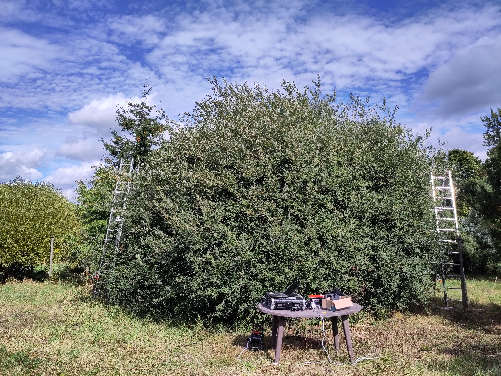

# 1. Internship Position

The internship was conducted within the research group of **Prof. Christian Wirth**, with additional support from **Prof. Marc Schönwiesner**. The work was primarily supervised by their PhD students, **Max Tölle** (project lead) and **Paul Friedrich** (acoustics).

The project investigated whether structural and morphological traits of trees can predict their acoustic filtering properties. Specifically, how much sound attenuation occurs across different frequency bands when sound passes through a tree canopy. This sits at the intersection of forest ecology, acoustic physics, and urban planning, motivated by the role of urban trees as potential noise barriers.

The internship spanned **6 weeks (300 hours à 45 minutes)** between July 2025 and March 2026, covering the full workflow from experimental design and fieldwork to data analysis and scientific presentation.

The complete codebase, analysis pipeline, fitted models, sonification examples, and interactive slider tools are available in a private Git repository. Access can be requested by contacting me at a.schackow@studserv.uni-leipzig.de.

---

# 2. Activities

## 2.1 Experimental Design and Planning (July–August 2025)

The project began with **terrestrial laser scanning (TLS)** of study trees at the Großpösna Arboretum near Leipzig (1 July 2025), conducted together with Max. These scans produced 3D point clouds of individual tree architecture - branching patterns, canopy density, and general form - which would later serve as the structural data source for predicting acoustic behavior.

Over the following weeks we planned the acoustic measurement protocol. Key decisions included:

- Using a **logarithmic frequency sweep** (20 Hz – 20 kHz, 0.5 s, 85 dB SPL) as the excitation signal, which concentrates more energy at low frequencies and improves the signal-to-noise ratio in the range most relevant for urban noise.
- **Full-duplex recording** with a TDT RP2 processor at 48,828 Hz sampling rate, ensuring synchronized playback and capture on the same clock to avoid phase drift.
- **Speaker and microphone placement** at the height of the densest canopy layer for each tree, determined from TLS voxelization. The sound path thus traverses the full crown diameter.
- A **single free-field reference measurement** (without tree) to deconvolve the speaker–microphone transfer function from the tree's acoustic response.

Equipment sourcing and calibration were coordinated with Paul (recording scripts and audio engineering) and Marc (measurement-grade microphones with known transfer functions).

## 2.2 Fieldwork (August–September 2025)

Fieldwork was conducted over **three days** at the Großpösna Arboretum, following rain-related delays. The first day was a test run with Marc and Max, which revealed practical issues with the recording script (distance correction non-functional, gain settings not optimal) and established the correct positioning procedure for speaker, rack, and microphone. The second day, with Paul, Tom, Laurin, and Max, served as the first real measurement session: three trees were measured with varying distances and heights, plus three additional trees with linear sweeps (later excluded from analysis). The third and main measurement day produced the bulk of the data: **17 trees** across 10 species (5 broadleaf, 5 needleleaf), each measured once from one direction with 10 consecutive sweep averages to reduce noise.

{width=75%}

The decision to measure one direction per tree and use a single reference was a pragmatic compromise: approaching leaf fall limited the available time, and we prioritized species coverage over per-tree replication.

## 2.3 Acoustic Processing Pipeline (October–December 2025)

I developed a Python processing pipeline to extract transfer functions from the raw recordings. The pipeline went through several iterations, ultimately consisting of five steps:

1. **Frequency-domain baselining:** Shifting the reference log-magnitude spectrum to match the recording's low-frequency energy, compensating for level differences between sessions.
2. **Onset detection and trimming:** Removing leading silence from both recording and reference using an amplitude threshold (2% of peak) with a local-mean validation check to avoid triggering on isolated spikes.
3. **Deconvolution:** Computing the tree's impulse response via regularized spectral division of the recording by the reference ($H(f) = Y(f) \cdot X_{\text{reg}}^{-1}(f)$), using the `pyfar` library with regularization outside 125–18,000 Hz.
4. **Time windowing:** Applying a Hann window (0.25 ms fade-in, 4.8 ms sustain, 1.0 ms fade-out, ~6 ms total) around the automatically detected IR onset to remove ground reflections and late arrivals.
5. **Transfer function extraction:** Computing the magnitude spectrum in dB and averaging into four frequency bands: low (125–500 Hz, traffic/machinery), mid (500–2,000 Hz, speech), high (2,000–18,000 Hz, broadband), and overall (125–18,000 Hz).

## 2.4 Structural and Leaf Trait Extraction (November–December 2025)

I wrote an R script to compute per-tree structural metrics from the TLS point clouds. After preprocessing (noise removal, ground normalization, centering, voxelization at 5 cm), the following metrics were extracted: height, crown volume, volumetric fill fraction, directional gap fraction (using the actual measurement angle), leaf voxel density, ENL (Effective Number of Layers), FHD (Foliage Height Diversity), and LAD (Leaf Area Density via Beer–Lambert). Leaf morphology traits (leaf area, thickness, LDMC, toughness) were extracted from the an additional measurement database. The merged dataset comprised 12 predictors (8 structural, 4 leaf), 4 response variables, and 17 trees.

## 2.5 Statistical Analysis (January 2026)

Forward stepwise linear regression was performed separately for broadleaf (n=9), needleleaf (n=8), and mixed (n=17) groups, with max 3 predictors and four independent selection criteria (Adjusted R², BIC, LOOCV RMSE, F-test). Using multiple criteria allows assessing whether predictor selection is robust or criterion-dependent.

{width=90%}

## 2.6 Sonification and Interactive Slider (February–March 2026)

Four urban noise scenarios - **highway traffic**, **tram**, **construction site**, and **children's playground** - were filtered through each tree's impulse response, producing per-tree audio files for direct listening comparison. An interactive slider tool applies the fitted low/mid/high regression models as a real-time 3-band parametric equalizer in the browser, with a live frequency response visualization showing how moving each trait slider changes the EQ curve. A dropdown switches between the four noise scenarios.

---

# 3. Results

All 17 trees attenuated sound to varying degrees. Broadleaf trees tended toward stronger high-frequency attenuation; needleleaf patterns were more variable.

**Broadleaf:** LDMC and LAD appeared as predictors across multiple criteria. The best model (low-frequency, BIC) achieved Adj. R² = 0.94 with LDMC, ENL, and leaf thickness — though n = 9 requires caution.

**Needleleaf:** Low and mid-frequency partially predictable. High-frequency: conservative criteria selected null models with n = 8.

The fitted equations drive the interactive slider tool, allowing real-time auditory exploration of how tree traits shape urban noise filtering.

---

# 4. Evaluation

## Supervision

The supervision was excellent. Max provided clear ecological guidance, Marc contributed acoustic methodology expertise, Christian Wirth offered strategic perspective, and Paul's technical support was essential for fieldwork. The team was responsive and supportive.

## Work Assessment

The internship covered experimental design, fieldwork, TLS processing, Python and R programming, signal processing, statistical modeling, and interactive sonification. The most valuable learning was the importance of checking results immediately during measurement campaigns.

## Limitations and Reflection

The main limitation is the small sample size (n ≈ 8–9 per group). Sixteen methodological limitations were identified across measurement design, processing pipeline, and structural metrics, each documented with a fix for future campaigns. The pipeline was substantially refactored after measurements; a repeat campaign would yield more robust results.

## Outlook

Three follow-up directions emerged: (1) the interactive slider as a sound installation with realistic urban noise; (2) seasonal leaf-on vs leaf-off measurements; and (3) scaling to MyDiv tree diversity plots to test whether biodiversity influences sound attenuation.
