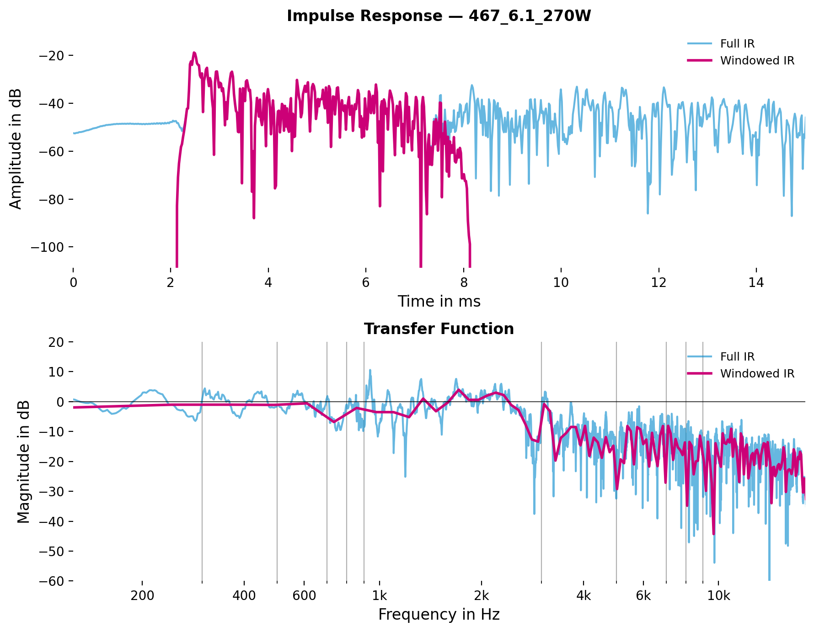
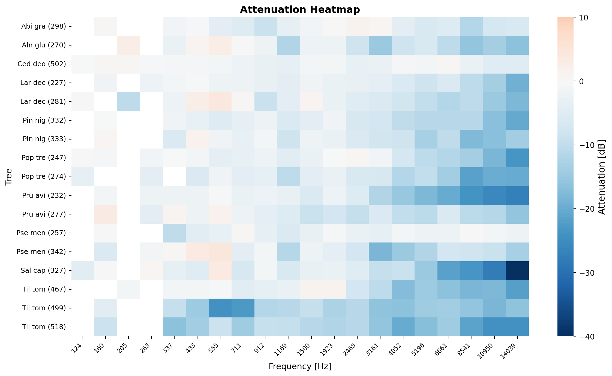
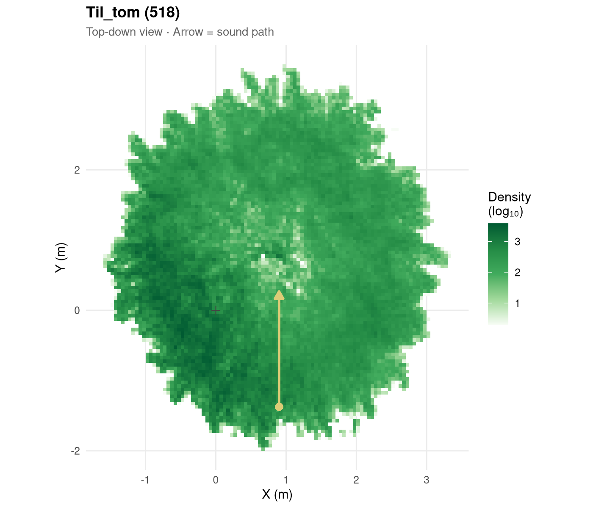
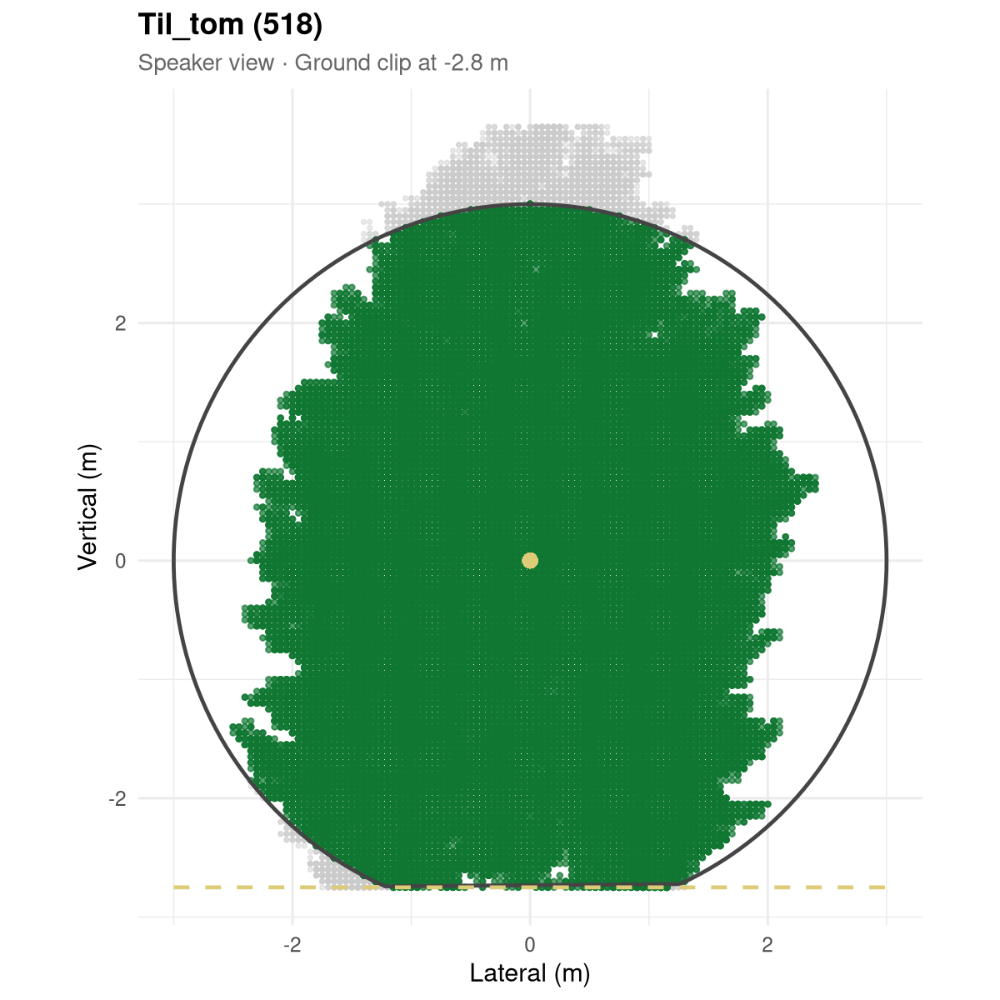
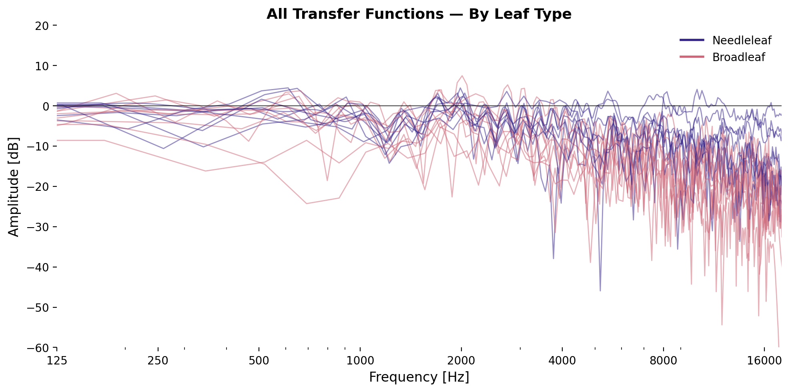
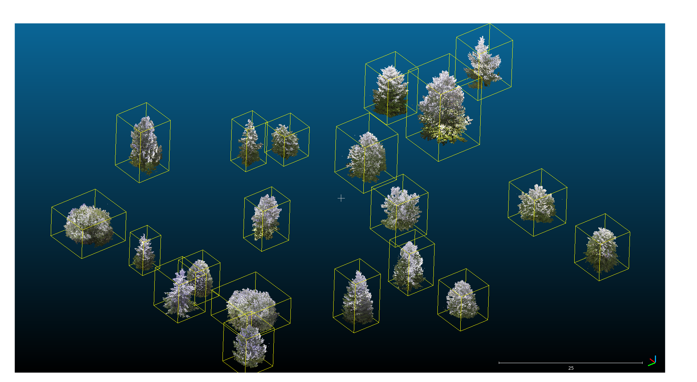
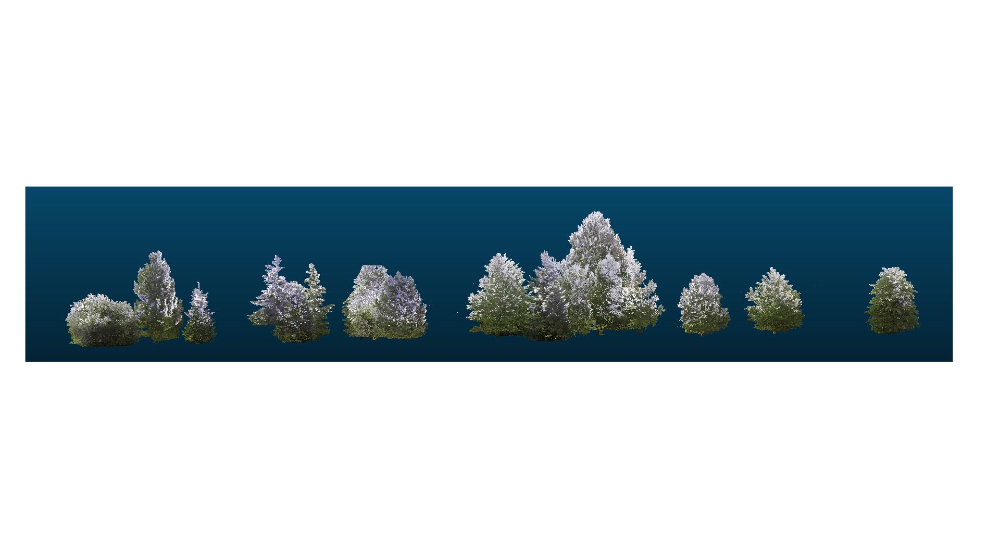

## Why Trees and Sound?

Urban noise is a health problem — traffic, construction, tram lines, playgrounds.

Trees are already planted everywhere. **Can we quantify their acoustic filtering?**

**Key question:** [Can measurable tree traits predict frequency-dependent sound attenuation?]{.highlight}

---

## Study Design

{width="100%"}

---

## Acoustic Measurement

- **Signal:** Logarithmic sweep 20 Hz – 20 kHz, 0.5 s, 85 dB SPL
- **10 averages** per tree to reduce noise
- **One free-field reference** (no tree) for all measurements
- Speaker and mic at **height of densest canopy layer** (from TLS)
- Equipment: Genelec speaker, TDT RP2 @ 48,828 Hz

---

## Processing Pipeline

1. [Baseline reference]{.highlight} — shift reference spectrum to match recording level
2. [Trim]{.highlight} leading silence from both signals
3. [Deconvolve]{.highlight} → impulse response (tree = LTI system)
4. [Window IR]{.highlight} (Hann, ~6 ms) → remove ground reflections
5. Extract [transfer function]{.highlight} (magnitude spectrum in dB)
6. Compute [attenuation per band]{.highlight}

---

## Deconvolution

$$H(f) = Y(f) \cdot X_{\text{reg}}^{-1}(f)$$

Regularized inversion prevents instability where reference has low energy (outside 125–18,000 Hz).

**Windowed IR:** 0.25 ms fade-in, 4.8 ms sustain, 1.0 ms fade-out

---

## Effect of Windowing

---

## Band Attenuation

**Band attenuation** = mean magnitude in dB per band:

$$\bar{A}_b = \frac{1}{N_b}\sum_{f_i \in b} |H(f_i)|_{\text{dB}}$$

| Band | Range | Context |
|------|-------|---------|
| [Low]{.highlight} | 125–500 Hz | Traffic, machinery |
| [Mid]{.highlight} | 500–2,000 Hz | Speech |
| [High]{.highlight} | 2,000–18,000 Hz | Broadband |

---

## Attenuation Heatmap

---

## Structural Traits from TLS

**Whole-tree:** Height, crown volume, vol. fill fraction

**Density:** Leaf voxel density, [gap fraction]{.highlight} (directional)

**Complexity indices:**

$$\text{ENL} = \frac{1}{\sum p_i^2} \qquad \text{FHD} = -\sum p_i \log_2 p_i$$

$$\text{LAD} = \frac{-\ln(G_f)}{k \cdot d_c}, \quad k = 0.5$$

**Leaf traits:** Area, thickness, [LDMC]{.highlight}, toughness

---

## Gap Fraction: Tilia tomentosa (518)

:::: {.columns}
::: {.column width="50%"}
{width="95%"}
:::
::: {.column width="50%"}
{width="95%"}
:::
::::

---

## Statistical Approach

- [**12 predictors** × **4 bands** × **3 groups**]{.highlight} (broadleaf n=9, needleleaf n=8, mixed n=17)
- [Forward stepwise]{.highlight} selection, **max 3 predictors**
- **4 criteria** applied independently: [Adj. R², BIC, LOOCV, F-test]{.highlight}
- If all 4 agree on a predictor → robust. If they disagree → that IS the result.
- Collinearity checked but not pre-filtered — stepwise handles this inherently

---

## All Transfer Functions by Leaf Type

---

## Predictor Consensus Across Criteria

**Broadleaf:** [LDMC]{.highlight}, [LAD]{.highlight}, leaf thickness across criteria | **Needleleaf:** null models for high-freq

---

## Model Performance

---

## Best Models → Slider Equations

::: {.small-table}

**Broadleaf:**

| Band | Equation | R² |
|------|----------|-----|
| Low  | $\hat{A} = \beta_0 + \beta_1 \cdot \text{LDMC} + \beta_2 \cdot \text{ENL} + \beta_3 \cdot \text{Thickness}$ | 0.94 |
| Mid  | $\hat{A} = \beta_0 + \beta_1 \cdot \text{LDMC} + \beta_2 \cdot \text{Crown Vol.} + \beta_3 \cdot \text{Thickness}$ | 0.57 |
| High | $\hat{A} = \beta_0 + \beta_1 \cdot \text{LAD} + \beta_2 \cdot \text{LDMC} + \beta_3 \cdot \text{Leaf Area}$ | 0.78 |

**Needleleaf:**

| Band | Equation | R² |
|------|----------|-----|
| Low  | $\hat{A} = \beta_0 + \beta_1 \cdot \text{Thickness} + \beta_2 \cdot \text{LAD} + \beta_3 \cdot \text{Leaf Area}$ | 0.62 |
| Mid  | $\hat{A} = \beta_0 + \beta_1 \cdot \text{LDMC} + \beta_2 \cdot \text{Gap Frac.}$ | 0.72 |
| High | No model outperforms intercept | — |

:::

**→ 3 equations → 3 filter gains → parametric EQ → filter urban noise in real time**

---

## Limitations: Measurement Design

::: {.small-text}

| # | Problem | Fix |
|---|---------|-----|
| 1 | Single direction per tree | ≥ 3 directions (0°, 120°, 240°) |
| 2 | Varying distances (3.8–9.0 m) | Standardize or distance-correct |
| 3 | Single reference for all trees | Per-tree reference |
| 4 | No replication | ≥ 3 reps per tree-direction |
| 5 | No seasonal contrast | Leaf-off measurement in winter |
| 6 | Height fixed to densest slice | Multiple heights or vertical integration |

:::

---

## Limitations: Processing Pipeline

::: {.small-text}

| # | Problem | Fix |
|---|---------|-----|
| 7 | Baselining: 200 bins arbitrary | Sensitivity analysis |
| 8 | Window length (6 ms) fixed | Adaptive or systematic comparison |
| 9 | Onset threshold (20 dB) | Noise-adaptive, verify per tree |
| 10 | Regularization range fixed | Justify from speaker response curve |
| 11 | Magnitude-only TF (phase discarded) | Preserve phase for future work |

:::

---

## Limitations: Structural Traits

::: {.small-text}

| # | Problem | Fix |
|---|---------|-----|
| 12 | Gap fraction: 3 m circle radius | Frequency-dependent (Fresnel zone) |
| 13 | Hit point sometimes near trunk | Start ray from known speaker position |
| 14 | LAD: Beer–Lambert k=0.5 from optics | Structural proxy, not physical |
| 15 | ENL/FHD designed for forest stands | Exploratory proxies for single trees |
| 16 | n ≈ 8–9 per group | More trees → MyDiv |

:::

---

## Next Steps: Technical and Conceptual

- [**Pipeline revised**]{.highlight} since measurements → repeat campaign would be stronger
- Seasonal measurements (leaf-on vs leaf-off)
- [Multiple directions]{.highlight}
- Single trees are inherently limited
- **→ MyDiv:** [Tree diversity plots]{.highlight} with controlled species mixtures
- → test biodiversity–attenuation relationship
- → stable models
- New question: **Does biodiversity influence sound attenuation?**

---

## Interactive Slider: Hear the Model

<a href="output/sliders/slider_broadleaf.html" target="_blank" 
   style="display:inline-block; padding:0.8em 2em; background:#4a6a5a; color:white; 
          border-radius:8px; text-decoration:none; font-size:1.1em; margin:0.3em;">
   Open Broadleaf Slider
</a>
<a href="output/sliders/slider_needleleaf.html" target="_blank"
   style="display:inline-block; padding:0.8em 2em; background:#4a6a5a; color:white; 
          border-radius:8px; text-decoration:none; font-size:1.1em; margin:0.3em;">
   Open Needleleaf Slider
</a>

Move [LDMC]{.highlight} → low-freq changes. Move [LAD]{.highlight} → high-freq changes.

Switch between [highway / tram / construction / children]{.highlight} to hear different urban noises filtered through the model.

*Requires local server:* `cd output && python -m http.server`

---

## Listen: Urban Noise Through Trees

  <select id="scenarioSelect" onchange="switchScenario()" style="background:#333;color:white;border:none;font-size:0.9em;padding:4px;">
    <option value="highway">Highway</option>
    <option value="tram">Tram</option>
    <option value="construction">Construction</option>
    <option value="children">Children</option>
  </select>

<audio id="treeAudio" style="display:none;"></audio>

*Select a noise scenario from the dropdown, then click a tree to hear it filtered.*

---

##

Tree traits can partially predict sound attenuation for broadleaf species — but the method needs scaling from single trees to diverse forest plots.

**Repository available on request.**
